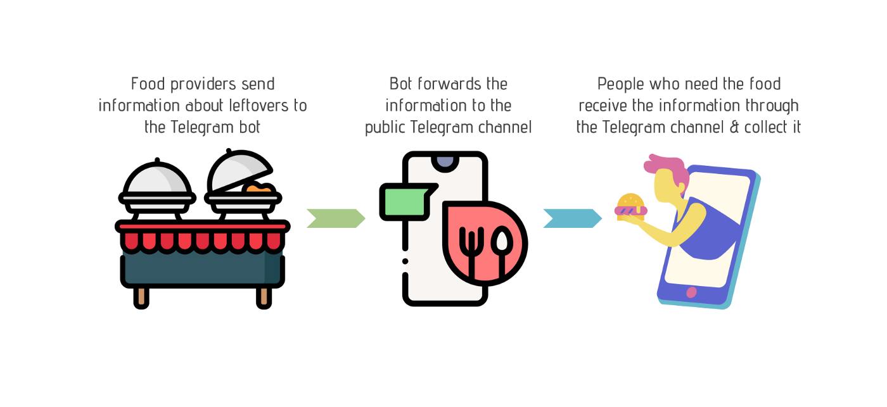
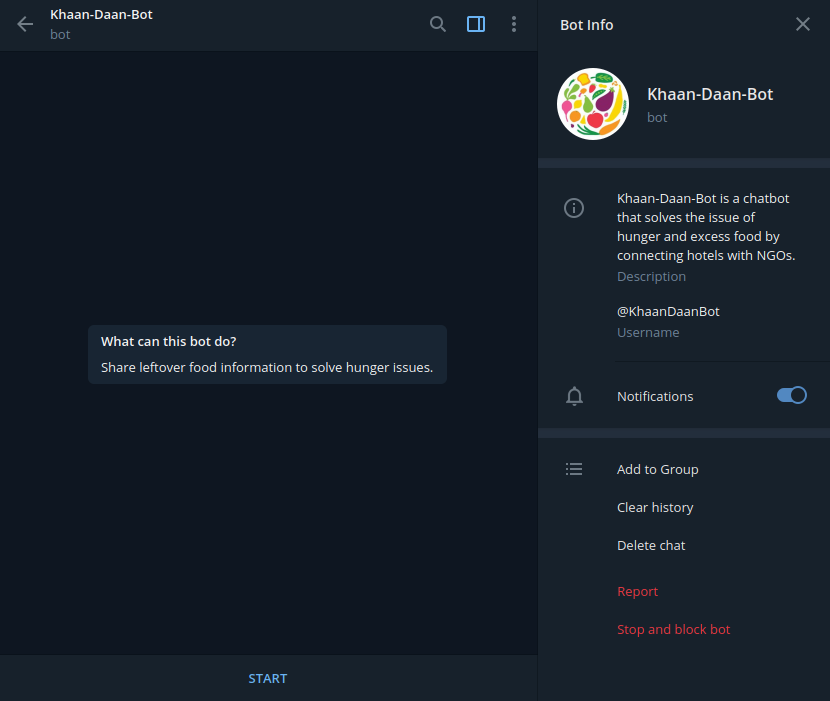
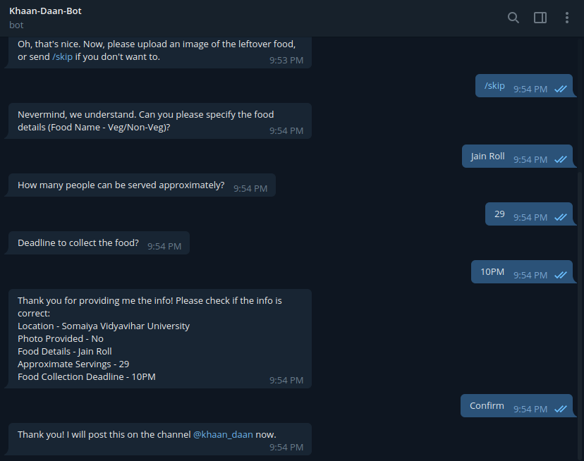
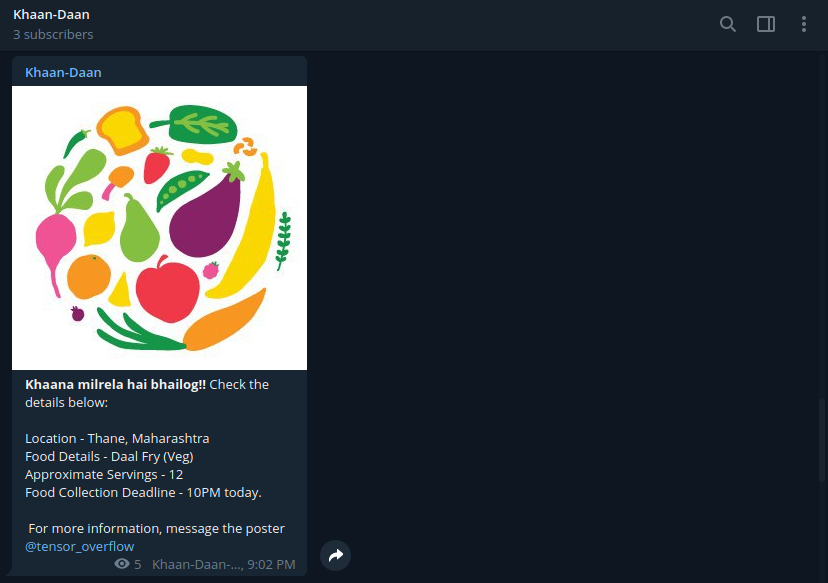
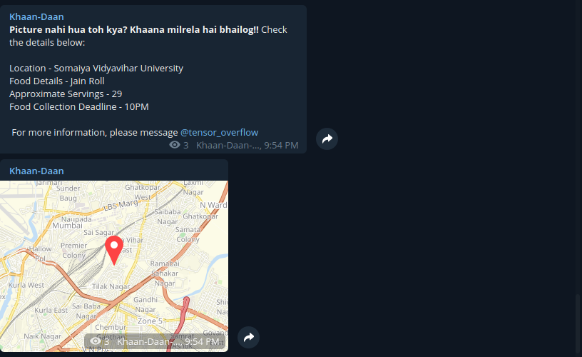

<h1 align="center">:fork_and_knife::rice: Khaan-दान Bot :bread::ramen:</h1>

 

 

---

<h2>Motivation:</h2>

A lot of food is wasted on a daily basis at weddings, parties, restaurants, and hotels in India. India, being a poverty affected country, deals with tough situations to meet everyone's basic demands. India currently ranks 105 out of 117 countries, below all South-East Asian countries on global hunger and poverty index. To deal with the issue of food wastage and poverty, we aim to have these two issues juxtapose each other to become a solution.  NGOs that work in the field of feeding the needy ones. Khaan-दान-Bot is an add-on Telegram bot that assists our website. Telegram provides a large number of users to be connected, hence at pandemic times like Corona Virus, it serves as a good platform to help amidst lockdown. 

---
### Project Flow:

 

### Goals of this chatbot:

* [x] To connect hotels and NGOs on a common platform.
* [x] Telegram provides a large number of users to be connected, hence at pandemic times like Corona Virus, it serves as a good platform to help amidst lockdown. 
* [x] Give hotels and restaurants the ability to broadcast their excess food availability on public channel.
* [x] Give NGOs the functionality to book excess food online by contacting the hotels/restaurants that advertise leftover food.
* [x] Provides Google Map-based location of the excess food advertised.

---

<h3 align="center">Khaan-दान-Bot in action:</h3>

<h4 align="center">Bot Home Page</h4>

 
<h4 align="center">Adding Details for Excess Food</h4>

 
<h4 align="center">Food Details (with pic) Posted on Public Channel</h4>

 
<h4 align="center">Food Details (without pic) Posted on Public Channel</h4>

 

---

### Future scope of this project:

* [ ] Allow users to directly place food order via chatbot.
* [ ] Allow user to select location on Maps or ask for current location instead of asking for typed address. 

### Tech Stack of this Project:

* Chat Platform: Telegram
* Backend: Python3
* Dependencies: GMaps API (specifically, Geocoding API), [python-telegram-bot](https://github.com/python-telegram-bot/python-telegram-bot)
* Libraries: Available in [requirements.txt](https://github.com/arghyadeep99/KhaanDaanBot/blob/master/requirements.txt).

### Chat with our chatbot at:

* To add information about food as a restaurant/hotel, chat [here](https://t.me/KhaanDaanBot) and add information.
* [Join](https://t.me/khaan_daan) this public channel to receive info of leftover food.

#### This project still has scope of development, so you can also contribute to this Project as follows:
* [Fork](https://github.com/arghyadeep99/KhaanDaanBot) this Repository.
* Clone your Fork on a different branch:
	* `git clone -b <name-of-branch> https://github.com/arghyadeep99/KhaanDaanBot.git`
* After adding any feature:
	* Goto your fork and create a pull request.
	* I will test your modifications and merge changes.

This project was done `because I was bored in quarantine.`

---
<h3 align="center"><b>Developed with :heart: by <a href="https://github.com/arghyadeep99">Arghyadeep Das</a>.</b></h1>
